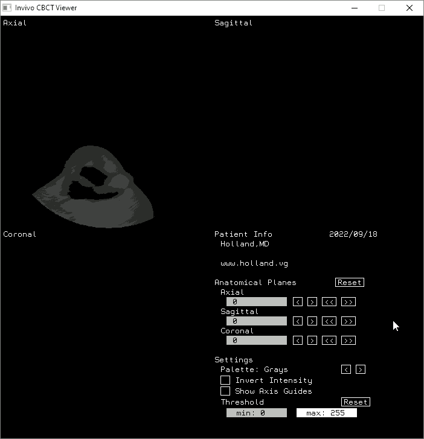

# invivo-cbct



## Synopsis

Open source Invivo case file viewer.

Companion article: https://holland.vg/post/digital-cbct-scans

## Full feature list

- Displays Invivo case files.

- Generates point clouds in Stanford PLY format.

- Dumps image data to 16-bit binary grayscale.

- Loads custom image sequences.

- Capable of creating new Invivo case files.

- Multi-threaded performance.

## Usage

```
args: invivo-cbct --options invivo.inv
  the input file is always the last argument;
  optional arguments (these are the --options):
    --threads
        * enables multithreading (if available)
    --viewer width,height
        * opens viewer window after loading data
        * width,height are window dimensions
        * e.g. --viewer 700,700
    --binary  W,H
        * indicates input file is binary data
          previously exported using the --dump option
        * e.g. --binary 536,536
    --series  start,end
        * indicates input path is an image series,
          expecting C style formatting e.g. tmp/%04d.png
        * loads images numbered [start,end], inclusive
        * reverse image order by reversing start/end e.g. 256,1
        * e.g. --series 1,256
    --invivo  out.inv Last,First,DOB
        * writes Invivo .inv file
          (supports converting binary data back to inv)
        * DOB (DateOfBirth) is expected to be in YYYYMMDD format
    --dump    out.bin
        * specifies output binary file to create;
        * the file will contain a series of raw images
          stored in 16-bit unsigned little-endian format
    --points  out.ply min,max,palette,density
        * specifies output point cloud file to create;
        * the file will be a Stanford .ply containing a series
          of vertices in xyzrgba format
        * writes only points w/ shades in value range [min,max];
          min/max are expected to be in the range [0,255]
        * palette is the name of a palette from the viewer options,
          but without spaces (e.g. Jet or GreenFireBlue);
          ('None' indicates no palette (aka gray));
        * density is expected to be in range 0.0 < n <= 1.0,
          but if no value is specified, density is adaptive,
          where brighter pixel clusters are assumed to be denser
          (XXX adaptive density is experimental; don't use it)
        * e.g. --points out.ply 20,255,None,0.25
```

## Compiling

It is recommended that you install `pthreads` before installing (or building) `JasPer`.

### Dependencies

- [pthreads](https://en.wikipedia.org/wiki/Pthreads)

- [JasPer](https://www.ece.uvic.ca/~frodo/jasper/)

- [SDL2](https://www.libsdl.org/)

### Compiling for Windows

[MXE](https://mxe.cc/) includes all the libraries you need to compile for Windows with minimal setup involved. It must be run from within a Unix environment.
